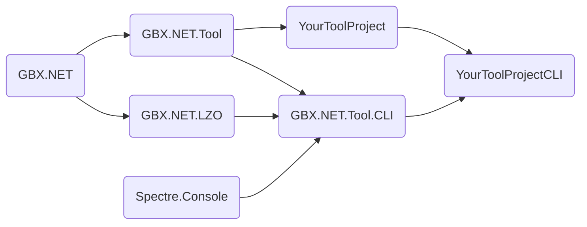

[](https://www.nuget.org/packages/GBX.NET/)
[](https://github.com/BigBang1112/gbx-net/releases)
[](#)
[](https://discord.gg/tECTQcAWC9)

Welcome to GBX.NET 2!

A general purpose library for Gbx files - data from Nadeo games like Trackmania or Shootmania, written in C#/.NET. It supports high performance serialization and deserialization of 400+ Gbx classes.

GBX.NET is not just a library that can read or write Gbx files, but also **a modding platform** that connects all Nadeo games together. It is exceptionally useful for bulk Gbx data processing, for example, when you want to fix broken sign locator URLs on hundreds of maps.

For any questions, open an issue, join the [GameBox Sandbox Discord server](https://discord.gg/9wAAJvKYyE) or message me via Discord DM: `bigbang1112`

### Navigation

- [Supported games](#supported-games)
- [File types](#file-types)
- [Framework support](#framework-support)
- **[Preparation](#preparation)**
  - [Create a new GBX.NET project (lightweight)](#create-a-new-gbxnet-project-lightweight)
  - [Create a new GBX.NET project (Visual Studio Code)](#create-a-new-gbxnet-project-visual-studio-code)
  - [Create a new GBX.NET project (Visual Studio)](#create-a-new-gbxnet-project-visual-studio)
- **[IMPORTANT INFO about the LZO and Gbx compression](#important-info-about-the-lzo-and-gbx-compression)**
- **[Usage (simple examples)](#usage-simple-examples)**
  - [Load a map and display block count per block name](#load-a-map-and-display-block-count-per-block-name)
  - [Modify and save a map](#modify-and-save-a-map)
  - [Processing multiple Gbx types](#processing-multiple-gbx-types)
  - [Read a large amount of replay metadata quickly](#read-a-large-amount-of-replay-metadata-quickly)
- [Tool framework](#tool-framework)
- [Zlib compression in Gbx](#zlib-compression-in-gbx)
- [Clarity](#clarity)
  - [Differences between `Gbx.Parse/Header/Node`](#differences-between-gbxparseheadernode)
  - [Do not repeat `gbx.Node.[any]` too often!](#do-not-repeat-gbxnodeany-too-often)
  - [Game Version Interfaces!](#game-version-interfaces)
- [Optimization](#optimization)
  - [Trimming (tree shaking)](#trimming-tree-shaking)
  - [Explicit vs. Implicit parse](#explicit-vs-implicit-parse)
  - [Only header parse](#only-header-parse)
  - [NativeAOT](#nativeaot)
  - [Asynchronous](#asynchronous)
- [Benchmarks](#benchmarks)
- [Build](#build)
  - [Nightly builds](#nightly-builds)
- [License](#license)
- [Plans](#plans)
  - [Gbx Explorer 2](#gbx-explorer-2)
  - [Lua support](#lua-support)
- [Special thanks](#special-thanks)
- [Alternative Gbx parsers](#alternative-gbx-parsers)

## Supported games

Many *essential* Gbx files from many games are supported:

- **Trackmania (2020)**, January 2026 update
- **ManiaPlanet 4**(.1), TM2/SM
- **Trackmania Turbo**
- ManiaPlanet 3, TM2/SM
- ManiaPlanet 2, TM2/SM
- ManiaPlanet 1, TM2
- **TrackMania Forever**, Nations/United
- Virtual Skipper 5
- TrackMania United
- **TrackMania Nations ESWC**
- **TrackMania Sunrise eXtreme**
- TrackMania Original
- TrackMania Sunrise
- TrackMania Power Up
- TrackMania (1.0)

## File types

Here are some of the known file types to start with:

| Latest extension | Class | Can read | Can write | Other extension/s
| --- | --- | --- | --- | ---
| Map.Gbx | [CGameCtnChallenge](Src/GBX.NET/Engines/Game/CGameCtnChallenge.chunkl) | Yes | Yes | Challenge.Gbx
| Replay.Gbx | [CGameCtnReplayRecord](Src/GBX.NET/Engines/Game/CGameCtnReplayRecord.chunkl) | Yes | No
| Ghost.Gbx | [CGameCtnGhost](Src/GBX.NET/Engines/Game/CGameCtnGhost.chunkl) | Yes | Yes
| Clip.Gbx | [CGameCtnMediaClip](Src/GBX.NET/Engines/Game/CGameCtnMediaClip.chunkl) | Yes | Yes
| Item.Gbx | [CGameItemModel](Src/GBX.NET/Engines/GameData/CGameItemModel.chunkl) | Yes | Yes | Block.Gbx
| Mat.Gbx | [CPlugMaterialUserInst](Src/GBX.NET/Engines/Plug/CPlugMaterialUserInst.chunkl) | Yes | Yes
| Mesh.Gbx | [CPlugSolid2Model](Src/GBX.NET/Engines/Plug/CPlugSolid2Model.chunkl) | Yes | Yes
| Shape.Gbx | [CPlugSurface](Src/GBX.NET/Engines/Plug/CPlugSurface.chunkl) | Yes | Yes
| Macroblock.Gbx | [CGameCtnMacroBlockInfo](Src/GBX.NET/Engines/Game/CGameCtnMacroBlockInfo.chunkl) | Yes | Yes
| LightMapCache.Gbx | [CHmsLightMapCache](Src/GBX.NET/Engines/Hms/CHmsLightMapCache.chunkl) | No | No
| SystemConfig.Gbx | [CSystemConfig](Src/GBX.NET/Engines/System/CSystemConfig.chunkl) | Yes | Yes
| FidCache.Gbx | [CMwRefBuffer](Src/GBX.NET/Engines/MwFoundations/CMwRefBuffer.chunkl) | Yes | Yes
| Scores.Gbx | [CGamePlayerScore](Src/GBX.NET/Engines/Game/CGamePlayerScore.chunkl) | No | No

**Full list of supported file types is available in the [SUPPORTED GBX FILE TYPES](SUPPORTED_GBX_FILE_TYPES.md)**.

## Framework support

Due to the recently paced evolution of .NET, framework support has been limited only to a few ones compared to GBX.NET 1:

- **.NET 10**
- .NET 9
- .NET 8
- .NET Standard 2.0

You can still use GBX.NET 2 on the old .NET Framework, but the performance of the library could be degraded. Depending on the needs, I can add explicit .NET Framework support, but so far there haven't been ones not replaceable with .NET Standard 2.0.

## Preparation

Using the NuGet packages is recommended.

### Create a new GBX.NET project (lightweight)

1. Install [.NET SDK 10](https://dotnet.microsoft.com/en-us/download/dotnet/10.0) (older versions won't work)
    - Windows: [here](https://dotnet.microsoft.com/en-us/download) or `winget install Microsoft.DotNet.SDK.10` (make sure you have WinGet installed)
    - [Linux](https://learn.microsoft.com/en-us/dotnet/core/install/linux) (just SDK)
2. Create a new C# script, for example `GbxScript.cs`
3. Open `GbxScript.cs` with your favorite text editor: `code . -g GbxScript.cs` (for example).
4. Write code - see [Usage (simple examples)](#usage-simple-examples).
5. Use `dotnet run GbxScript.cs` to run the script.

### Create a new GBX.NET project (Visual Studio Code)

1. Install [C# Dev Kit](https://marketplace.visualstudio.com/items?itemName=ms-dotnettools.csdevkit) extension.
2. Click on `Create .NET Project` button, or press <kbd>Ctrl</kbd>+<kbd>Shift</kbd>+<kbd>P</kbd>, type `.NET: New Project`.
3. Select `Console App` and create your project.
4. Open a new terminal and type `dotnet add package GBX.NET` to add GBX.NET 2.
5. *(optional)* Add the GBX.NET.LZO 2 NuGet package: `dotnet add package GBX.NET.LZO`
5. Write code (without the `#:package`s at the top) - see [Usage (simple examples)](#usage-simple-examples).
6. Run and debug as usual, select C# if prompted.

### Create a new GBX.NET project (Visual Studio)

1. Create a new Console project
2. Under your project in Solution Explorer, right-click on Dependencies and select `Manage NuGet packages...`
3. Search `GBX.NET` and click install, optionally install `GBX.NET.LZO`
4. Write code (without the `#:package`s at the top) - see [Usage (simple examples)](#usage-simple-examples).

## IMPORTANT INFO about the LZO and Gbx compression

Reading or writing compressed Gbx files **require** to include the GBX.NET.LZO 2 library (or any other implementation that uses the `ILzo` interface). This is how you can include it:

```cs
#:package GBX.NET@2.*
#:package GBX.NET.LZO@2.*

using GBX.NET;
using GBX.NET.LZO;

Gbx.LZO = new Lzo();
```

You should run this line of code **only once** at the start of the program.

In Blazor WebAssembly, you must additionally enable `WasmBuildNative`, as the `Lzo` implementation utilizes the native build. This also requires having [WebAssembly Build Tools](https://learn.microsoft.com/en-us/aspnet/core/blazor/webassembly-build-tools-and-aot?view=aspnetcore-10.0) installed.

```xml
<PropertyGroup>
  <WasmBuildNative>true</WasmBuildNative>
</PropertyGroup>
```

In case that doesn't work for you, you can substitute with the older `MiniLZO` implementation, which is written in C#.

The compression logic is split up from the read/write logic to **allow GBX.NET 2 library to be distributed under the MIT license**, as Oberhumer distributes the open source version of LZO under the GNU GPL v2+. Therefore, using GBX.NET.LZO 2 requires you to license your project under the GNU GPL v3, see [License](#license).

**Gbx header is not compressed** and can contain useful information (icon data, replay time, ...), and also many of the **internal Gbx files from Pak files are not compressed**, so you can avoid LZO for these purposes.

## Usage (simple examples)

> These examples expect you to have .NET 10 installed. In older versions, you may need to include relevant packages with `dotnet add package` command or add the `using System.Linq;` statement at the top.

### Load a map and display block count per block name

```cs
#:package GBX.NET@2.*
#:package GBX.NET.LZO@2.*

using GBX.NET;
using GBX.NET.Engines.Game;
using GBX.NET.LZO;

Gbx.LZO = new Lzo();

var map = Gbx.ParseNode<CGameCtnChallenge>("Path/To/My.Map.Gbx");

foreach (var block in map.GetBlocks().GroupBy(x => x.Name))
{
    Console.WriteLine($"{block.Key}: {block.Count()}");
}
```

This will print out all blocks on the map and their count. This code can potentially crash for at least 3 reasons:

1. The Gbx file is **not a map**. See [Explicit vs. Implicit parse](#explicit-vs-implicit-parse) in the [Optimization](#optimization) part.
2. There's **a Gbx exception**. See *Exceptions in GBX.NET 2* (TBD).
3. There's a file system problem.

### Modify and save a map

GBX.NET's strength is in its ability to modify Gbx files and save them back. This example shows how you can change the map name of a map:

```cs
#:package GBX.NET@2.*
#:package GBX.NET.LZO@2.*

using GBX.NET;
using GBX.NET.Engines.Game;
using GBX.NET.LZO;

Gbx.LZO = new Lzo();

var gbx = Gbx.Parse<CGameCtnChallenge>("Path/To/My.Map.Gbx");
var map = gbx.Node; // See Clarity section for more info

map.MapName = "My new map name";

gbx.Save("Path/To/MyNew.Map.Gbx");
```

The trick here is that the Gbx properties are saved in the `gbx` object variable (`Gbx` class). These properties ensure that the Gbx file is saved correctly across all Trackmania versions.

If you were to go with `ParseNode` in this case, this would **not work for TMF and older games**, but it is still possible if you specify the Gbx parameters in the `Save` method:

```cs
map.Save("Path/To/MyNew.Map.Gbx", new()
{
    PackDescVersion = 2 // Latest known PackDesc version in TMF
});
```

For TMS or TMN ESWC, you would have to specify `ClassIdRemapMode` for example:

```cs
map.Save("Path/To/MyNew.Map.Gbx", new()
{
    ClassIdRemapMode = ClassIdRemapMode.Id2006
    PackDescVersion = 1
});
```

These save parameters depend on the game of choice, but **since Trackmania 2, this does not matter** and you can safely use `Save` method on `CMwNod` without additional settings.

For more details, see [Differences between `Gbx.Parse/Header/Node`](#differences-between-gbxparseheadernode) in the [Clarity](#clarity) section.

### Processing multiple Gbx types

This example shows how you can retrieve ghost objects from multiple different types of Gbx:

```cs
#:package GBX.NET@2.*
#:package GBX.NET.LZO@2.*

using GBX.NET;
using GBX.NET.Engines.Game;
using GBX.NET.LZO;

Gbx.LZO = new Lzo();

var node = Gbx.ParseNode("Path/To/My.Gbx");

var ghost = node switch
{
    CGameCtnReplayRecord replay => replay.GetGhosts().FirstOrDefault(),
    CGameCtnMediaClip clip => clip.GetGhosts().FirstOrDefault(),
    CGameCtnGhost g => g,
    _ => null
};

if (ghost is null)
{
    Console.WriteLine("This Gbx file does not have any ghost.");
}
else
{
    Console.WriteLine("Time: {0}", ghost.RaceTime);
}
```

Using pattern matching with non-generic `Parse` methods is a safer approach (no exceptions on different Gbx types), but less trim-friendly, see [Explicit vs. Implicit parse](#explicit-vs-implicit-parse) in the [Optimization](#optimization) section.

### Read a large amount of replay metadata quickly

In case you only need the most basic information about many of the most common Gbx files (maps, replays, items, ...), do not read the full Gbx file, but only the header part. It is a great performance benefit for disk scans.

> [!NOTE]
> Reading only the header also does not infect you with GNU GPL v3, and you can use licenses compatible with MIT. The header is not compressed with LZO.

```cs
#:package GBX.NET@2.*

using GBX.NET;
using GBX.NET.Engines.Game;

foreach (var filePath in Directory.EnumerateFiles("Path/To/My/Directory", "*.Replay.Gbx", SearchOption.AllDirectories))
{
    try
    {
        DisplayBasicReplayInfo(filePath);
    }
    catch (Exception ex)
    {
        Console.WriteLine($"Gbx exception occurred {Path.GetFileName(filePath)}: {ex}");
    }
}

void DisplayBasicReplayInfo(string filePath)
{
    var nodeHeader = Gbx.ParseHeaderNode(filePath);

    if (nodeHeader is CGameCtnReplayRecord replay)
    {
        Console.WriteLine($"{replay.MapInfo}: {replay.Time}");
    }
}
```

This code should only crash in case of a file system problem. Other problems will be printed out in the console.

> [!NOTE]
> It is still valuable to parse the full Gbx even when you just want a piece of information available in header, because **body info overwrites header info**. So you can use the benefit of full parse to fool people tackling with the Gbx header.

## Tool framework

Tool framework (`GBX.NET.Tool*` libraries) is a work-in-progress simple way to create rich tools that can be adapted to different environments.

Currently supported environments:
- **Console** (`GBX.NET.Tool.CLI`)

Planned environments:
- Blazor (`GBX.NET.Tool.Blazor`) - both server and WebAssembly
- HTTP server (`GBX.NET.Tool.Server`)
- Discord bot (`GBX.NET.Tool.Discord.Bot`)

The tool framework guides you with this project structure:



- Structure: Tool library (`YourToolProject`) and at least 1 implementation application of it (`YourToolProjectCLI`).
- Tool library references `GBX.NET.Tool` and implementation application references `GBX.NET.Tool.CLI`.
- `GBX.NET.Tool.CLI` currently uses LZO by default, no need to reference it additionally.

Tool library has a primary tool class that implements `ITool` interface. There should be only one.

Tool class accepts input through constructors (best one is picked according to input provided by implementation). The tool can output as "produce" (`IProductive`), which creates objects without mutating the input (for example, create MediaTracker clip from replay inputs), or "mutate" (`IMutative`) which creates objects while also causing changes to the input (for example, modifying a map without having to recreate it again).

Samples are available [here](Samples/Tool/).

## Zlib compression in Gbx

There are a few places where Gbx includes additional zlib-compressed data:

- Ghost samples
  - `CGameGhost.SampleData`
- Record data (general replay data or TM2020 ghost samples)
  - `CGameCtnReplayRecord.RecordData`, `CGameCtnGhost.RecordData`, `CGameCtnMediaBlockEntity.RecordData`
- Lightmap data of a map
  - `CGameCtnChallenge.LightmapCache`, additional lightmap parameters

GBX.NET does not include zlib algorithm by default to read this data. Properties will often throw a `ZLibNotDefinedException`.

To "unlock" this data, you need to specify zlib implementation:

```cs
#:package GBX.NET@2.*
#:package GBX.NET.ZLib@2.* // IMPORTANT to include this package!

using GBX.NET;
using GBX.NET.ZLib;

Gbx.ZLib = new ZLib();
```

> [!NOTE]
> Zlib-compressed data is **currently read-only for ghost samples and record data**, lightmap data is the only zlib data that can be modified with GBX.NET. Write support for ghost samples and record data is planned for 2.4.

The data is often stored in properties of type `CompressedData` which are byte arrays with additional uncompressed data size for validation. If there's a property with this type (`CGameCtnChallenge.LightmapCacheData` for example), zlib data will be stored there no matter if the zlib implementation is included, so read/write consistency is guaranteed.

> The current reason why the zlib implementation is split similarly to LZO (even when zlib license is perfectly fine) is that there aren't any good official solutions by Microsoft that would work for .NET Standard 2 (new `ZlibStream` is promising but .NET 6+ only, still not tested enough if reliable), and third party solutions are also of a questionable quality. But this topic is continously under attention and the zlib implementation is slowly improving.

GBX.NET.PAK uses a different zlib solution due to very specific patterns to follow during decryption + decompression in .pak data.

## Clarity

This section describes best practices to keep your projects clean when using GBX.NET 2.

### Differences between `Gbx.Parse/Header/Node`

Gbx files contain many different parameters that are not exactly part of the game objects. We commonly use `ParseNode` or `ParseHeaderNode` to simplify the access level, as Gbx parameters are usually unnecessary to know about, but they have to be present to ensure consistent serialization.

You can still save nodes into Gbx files by using the `Save` method - be careful specifying the Gbx parameters correctly, like the class ID mappings (wrap/unwrap).

- `Gbx.Parse`
  - Reads the full Gbx file, saves the `Node` and many of its parameters to the `Gbx` object, and returns the `Gbx` object.
- `Gbx.ParseNode`
  - Same as `Gbx.Parse`, except only the `Node` itself is returned and `Gbx` object parameters are discarded and garbage collected, except for `GbxRefTable`, which is referenced further down the nodes.
  - Can return `null` on unknown Gbx file, while `Gbx.Parse` can't.
- `Gbx.ParseHeader`
  - Reads only the uncompressed Gbx header part, saves the `Node` and *most* of its parameters to the `Gbx` object, and returns the `Gbx` object.
- `Gbx.ParseHeaderNode`
  - Same as `Gbx.ParseHeader`, except only the `Node` itself is returned and `Gbx` object parameters are discarded and garbage collected.
  - Can return `null` on unknown Gbx file, while `Gbx.ParseHeader` can't.

### Do not repeat `gbx.Node.[any]` too often!

It is fairly common to see people repeat the `gbx.Node.something` instead of saving the `gbx.Node` to a new, shorter variable to improve code clarity. The original guide was to rather refer to using `Gbx.ParseNode`, however, in GBX.NET 2, some Gbx parameters can be lost by using `Gbx.ParseNode`, so for simplification, `Gbx.Parse` is recommended to use when the goal is to modify the file.

> [!NOTE]
> That doesn't mean you cannot use `Gbx.ParseNode` for Gbx modification. In fact there's no difference since TM2 for saving nodes retrieved using `Gbx.Parse` or `Gbx.ParseNode`. In TMUF and older versions, when you're using `Gbx.ParseNode`, you may need to specify a few write parameters that were stored in the original `Gbx` object (which got discarded).

If you're accessing a lot of main node members, prefer saving `gbx.Node` into an additional variable.

```cs
var gbx = Gbx.Parse<CGameCtnChallenge>("Path/To/My.Map.Gbx");
var map = gbx.Node;

Console.WriteLine(map.MapName);
Console.WriteLine(map.AuthorLogin);
Console.WriteLine(map.AuthorNickname);
Console.WriteLine(map.BuildVersion);
```

It looks better than this:

```cs
var gbx = Gbx.Parse<CGameCtnChallenge>("Path/To/My.Map.Gbx");

Console.WriteLine(gbx.Node.MapName);
Console.WriteLine(gbx.Node.AuthorLogin);
Console.WriteLine(gbx.Node.AuthorNickname);
Console.WriteLine(gbx.Node.BuildVersion);
```

### Game Version Interfaces!

Interfaces (short name of Game Version Interfaces) is a new *upcoming* feature of GBX.NET 2 where you can scope the Gbx classes for specific Trackmania/Shootmania games to hide unrelated properties and avoid large amount of null checks. These null checks will be done for you behind the scenes and will throw exceptions if they are "exceptional" for the game version you pick.

Currently, it is split into 3 ideas:
- Chunk Game Version Specification *(partially available now)*
  - Every `CMwNod` has a member `GameVersion` that can guess from which game the Gbx file is, or where it could be supported.
- Generated Game Version Interfaces *(still WIP)*
- Generated Builders *(still WIP)*

Since 2.0.1, the experimentation of Game Version Interfaces started on the `CGameCtnChallenge` and `CGameCtnBlock` classes. Example:

```cs
using GBX.NET;
using GBX.NET.Engines.Game;
using GBX.NET.Interfaces.Game;

var map = Gbx.ParseNode<CGameCtnChallenge, IGameCtnChallengeTMF>();

foreach (var block in map.GetBlocks())
{
    Console.WriteLine(block.Name);
    // Console.WriteLine(block.Color); -- block color is not available in TMF
}
```

## Optimization

GBX.NET 2 introduced rich optimization techniques to improve both performance and compiled size of your applications.

The goal of these optimizations is to prove that GBX.NET is not "too big" for anything small.

### Trimming (tree shaking)

On *publish* (the final build), you can trim out unused code by using this property in `.csproj`:

```xml
<PropertyGroup>
    <PublishTrimmed>true</PublishTrimmed>
</PropertyGroup>
```

The library does not load anything dynamically and does not use reflection, so this is **fully supported**.

GBX.NET is a huge library when everything is included (over 1.5MB), so please use this whenever it's possible. Code was written to be very trimmable, so the difference is huge (much bigger than in GBX.NET v1).

> [!NOTE]
> Expect this to work only with `dotnet publish`.

However, in case you wanna use reflection on GBX.NET, it is strongly recommended to simply turn off trimming of this library. **In case of Blazor WebAssembly specifically, it's worth noting that the release build trims automatically**, so in case you're using reflection, specify the `TrimmerRootAssembly` on GBX.NET:

```xml
<ItemGroup>
    <TrimmerRootAssembly Include="GBX.NET" />
</ItemGroup>
```

### Explicit vs. Implicit parse

*In the past, the difference between these two used to be only to reduce the amount of written code by the consumer and making the type more strict, the performance was exactly the same.*

GBX.NET 2 changes this majorly by making the Explicit parse way more explicit. The **Explicit parse** runs through a slightly modified code that does slightly simpler things than the Implicit parse:

- The nodes are instantiated right away using the generics.
  - If the node type is more of a base type, there's a check for all inherited classes, in a much smaller switch statement than the Implicit parse uses.
  - If the type cannot match, exception is thrown.
- Smaller switch statement of classes allows **effective trimming** that can reduce the library size much more than it is able to with the Implicit parse.
- You cannot use Explicit parse on unknown Gbx files.
- Explicit parse is still considered fairly experimental and it might sometimes fail its job.

**Explicit parse:**

```cs
Gbx<CGameCtnChallenge> gbxMap = Gbx.Parse<CGameCtnChallenge>("Path/To/My.Map.Gbx");
CGameCtnChallenge map = Gbx.ParseNode<CGameCtnChallenge>("Path/To/My.Map.Gbx");
Gbx<CGameCtnChallenge> gbxMap = Gbx.ParseHeader<CGameCtnChallenge>("Path/To/My.Map.Gbx");
CGameCtnChallenge gbxMap = Gbx.ParseHeaderNode<CGameCtnChallenge>("Path/To/My.Map.Gbx");
```

The Implicit parse cannot guess the type right away, but it does not fail on unknown Gbx files. It is also less effective with library trimming.

**Implicit parse:**

```cs
Gbx gbxMap = Gbx.Parse("Path/To/My.Map.Gbx");
CMwNod map = Gbx.ParseNode("Path/To/My.Map.Gbx");
Gbx gbxMap = Gbx.ParseHeader("Path/To/My.Map.Gbx");
CMwNod gbxMap = Gbx.ParseHeaderNode("Path/To/My.Map.Gbx");
```

To figure out a type, use **pattern matching** or **casting**.

### Only header parse

As mentioned earlier, you can largely speed up Gbx reading in case your information is available in the header part of Gbx.

However, if the information is something serious, you should still *validate it against the body*, in other words: read the full Gbx, which this process will use the information from the body instead, and overwrite what was read in the header.

### NativeAOT

GBX.NET **fully supports** NativeAOT, and it is highly recommended to use its potential on smaller-sized applications:

```xml
<PropertyGroup>
    <PublishAot>true</PublishAot>
</PropertyGroup>
```

It also automatically trims the application (no need for `<PublishTrimmed>true</PublishTrimmed>`).

On basic GBX.NET applications, native compilation has a couple of improvements:
- Reduces trimmed standalone binary size from ~7MB to 2.8MB.
- Startup time is reduced from 50ms to 0.5ms (JIT is removed, so you should be only bottlenecked by disk speed).
- If you're using only the MIT License libraries, you can make your project harder to reverse engineer.
- The app feels generally lighter, but can be slightly slower for long-running process than a runtime app with JIT (very small difference).

> [!NOTE]
> Expect this to work only with `dotnet publish`.

### Asynchronous

Reading Gbx files asynchronously is currently only partially supported, but can already be more effective in networking scenarios.

- Asynchronous reading currently only takes effect in the Gbx **body** part.
- It is used on reading the compressed LZO buffer, which is quite large, so async can have a positive effect.
- It is also planned to use async reading on the Gbx map thumbnail JPEG buffer.
- It is not planned to use async reading while reading the contents of the decompressed body, as it's already fully there in memory, and it could rather hurt the performance than improve it.

The library uses sync method generators to simplify async method definitions without duplicating code.

## Build

> [!NOTE]
> You don't need to build the solution/repository to use GBX.NET, **NuGet packages have been made for you**. This is only for internal development purposes.

> The solution has more than 30 projects for different purposes, make sure you have enough disk space, the full build could take up a couple hundreds of megabytes.

Make sure you have these framework SDKs available:

- **.NET 10**
- .NET 9
- .NET 8
- .NET Standard 2.0

**Visual Studio 2022** should be able to install those with default installation settings. Using Visual Studio 2019 will not work.

You should also have **.NET WebAssembly Build Tools** installed additionally to build the full solution. It is required for Gbx Explorer to work properly, as it uses native LZO implementation compiled into WebAssembly.

In Visual Studio, you can just use Build Solution and everything should build. JetBrains Rider has been tested and also works.

In .NET CLI, run `dotnet build` on the solution (`.slnx`) level.

### Nightly builds

Every **5AM UTC**, there is a new build from the `dev` branch published on https://nuget.gbx.tools/ of the base GBX.NET package (soon also GBX.NET.Tool*).

Go to `%appdata%/NuGet` and modify the `NuGet.Config` file to include the package source:
```xml
<?xml version="1.0" encoding="utf-8"?>
<configuration>
  <packageSources>
    <add key="nuget.gbx.tools" value="https://nuget.gbx.tools/v3/index.json" /> <!-- add this -->
  </packageSources>
</configuration>
```
Then you can select the `nuget.gbx.tools` package source and fetch nightly builds from there.

You can also create a `nuget.config` file in your solution directory and put the XML above into it, which makes it easier to build your project in CI or with generally less preparation.

> In the past, nightly builds were pushed to GitHub Packages which required you to provide access tokens to be able to read the packages. Nightly builds are no longer pushed to GitHub Packages.

## License

GBX.NET 2 is licensed under multiple licenses, depending on the part of the project. Here are the licenses and their directories:

- MIT License
  - **Src/GBX.NET**
  - Src/GBX.NET.Crypto
  - Src/GBX.NET.Hashing
  - Src/GBX.NET.Json
  - Src/GBX.NET.NewtonsoftJson
  - Src/GBX.NET.Imaging
  - Src/GBX.NET.Imaging.ImageSharp
  - Src/GBX.NET.Imaging.SkiaSharp
  - Src/GBX.NET.Tool
  - Src/GBX.NET.ZLib
  - Src/GBX.NET.Lua
  - Generators
- GNU GPL v3 License
  - **Src/GBX.NET.LZO**
  - Src/GBX.NET.Tool.CLI
  - **Src/GBX.NET.PAK**
  - Samples
  - Tools
- The Unlicense
  - Resources

The Unlicense also applies on information gathered from the project (chunk structure, parse examples, data structure, wiki information, markdown).

If you use the LZO compression library, you must license your project under the GNU GPL v3.

## Plans

### Gbx Explorer 2

Gbx Explorer 2 *will* be a complete remake of the old Gbx Explorer, fixing most of what the old version lacked. It is planned to be a relatively huge project, so it may take time to do.

Old Gbx Explorer is compatible with GBX.NET 2, but some features have been stripped off.

### Lua support

GBX.NET 2 *will* support dynamic Lua script execution around the .NET code, to simplify the library usage even further.

It should be supported to run offline locally through a **Gbx Lua Interpreter tool** and in **Gbx Explorer 2 in web browser, PWA, and Photino build.**

The goal is to also make it viable for NativeAOT.

## Special thanks

Without these people, this project wouldn't be what it is today:

- Stefan Baumann (Solux)
- Melissa (Miss)
- florenzius
- Kim
- tilman
- GreffMASTER
- AurisTFG
- schadocalex
- James Romeril
- frolad (Juice)
- Mika Kuijpers (TheMrMiku)
- donadigo

And many thanks to every bug reporter!

## Alternative Gbx parsers

- [gbx-py](https://github.com/schadocalex/gbx-py) by schadocalex (advanced read+write Gbx parser specialized on TM2020 and custom items)
- [gbx-ts](https://github.com/thaumictom/gbx-ts) by thaumictom (read-only Gbx parser for TypeScript)
- [ManiaPlanetSharp](https://github.com/stefan-baumann/ManiaPlanetSharp) by Solux (C# toolkit for accessing ManiaPlanet data, including read-only Gbx parser used by ManiaExchange)
- [pygbx](https://github.com/donadigo/pygbx) by Donadigo (read-only Gbx parser for Python)
